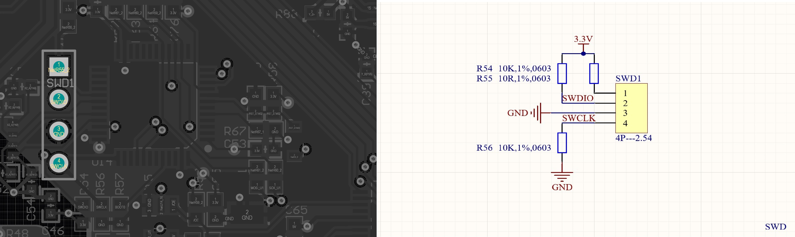
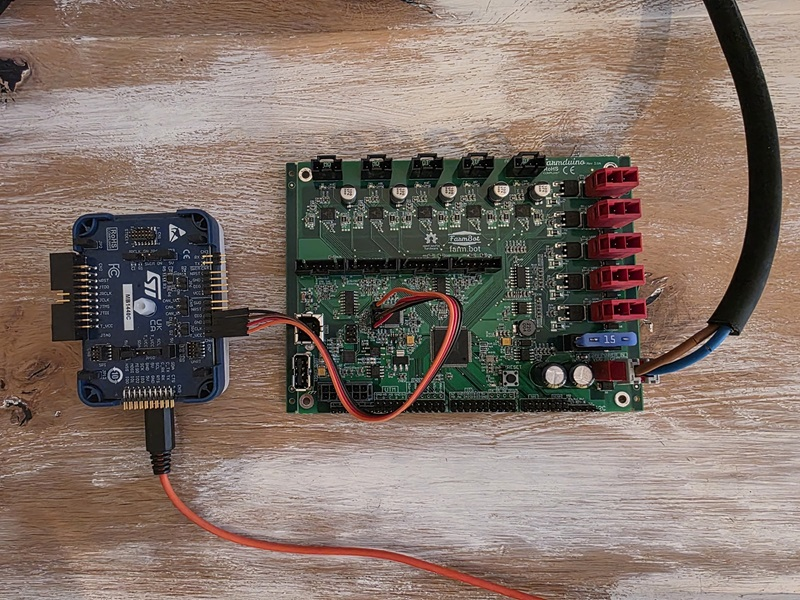

# Initial Programming STM32

## Prerequisites
* an ST standalone debugger and programmer, such as the official  [STLINK-V3SET](https://www.st.com/en/development-tools/stlink-v3set.html) for STM32 and STM8
* micro USB cable for connectiong the STLINK V3SET with a PC
* local PC with USB interface with STM32 programming software installed, for example [STM32CubeProgrammer](https://www.st.com/en/development-tools/stm32cubeprog.html)

The STM32 coprocessor is dedicated to monitoring the rotary encoders.

|Actors |Connection|Properties|
|-|-|-|
|Host PC <--> STLINK V3SET|USB 2.0|Serial|
|STLINK <--> STM32|SWD|8.000 kHz, 32bit|

### Physical Setup

The STM32 circuit of the Farmduino PCB comes with an SWD interface to program the MCU. It is 1x4 pin header located next to the STM32 on the PCB.

You will need to connect those 4 pins on the Farmduino PCB with jumper cables to their counterparts on the programmer, in my case an STLINK V3SET. Make sure none of the devices is powered during wiring! In this case the STLINK V3SET needs to be set up with the MB1440 adapter board (also included in the V3SET). The adapter board has SWD interface at connectors CN1, CN2 and CN6. I used CN6

|Farmduino ISCP|STLINK V3SET|
|-|-|
|`VCC`|`VCC`|
|`SWDIO`|`DIO`|
|`GND`|`GND`|
|`SWCLK`|`CLK`|

Once you are finished, it should look similar like this.

### Software setup

I used the official software STMCubeProgrammer to burn the firmware. 

* download the latest firmware of the [enoder tracker](https://github.com/MotorDynamicsLab/encoder-tracker). 
* In the `Device Memory` tab, `Connect` the to the Farmduino STM32
* Select the `Open file` tab and load the binary firmware file and `download` it to the board.

If all goes well, the IDE will respond with `Data read successully` in the output log.